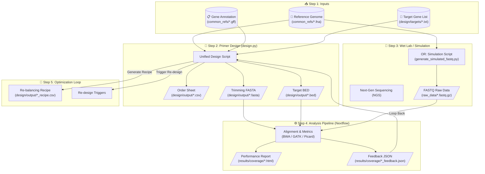

# My Amplicon Project: Comprehensive Instruction Manual 🧬

Welcome to the **integrated Multiplex PCR Ecosystem**. This project provides a complete end-to-end professional workflow for designing targeted sequencing primers, simulating their performance, and analyzing real or simulated sequencing data with automated feedback loops for laboratory optimization.

---

## 🗺️ System Architecture & Workflow

This project is divided into two primary modules: **Design** and **Analysis**, bridged by an **Automated Feedback Loop**.



---

## 🛠️ Installation & Setup

### Windows (WSL / Ubuntu)
This is the recommended environment for the full analysis pipeline.
1.  **Run the Setup Script**:
    ```bash
    wsl bash analysis/setup_wsl.sh
    ```
    *This script installs: Miniconda, BWA, GATK, Samtools, Nextflow, Cutadapt, and Picard.*
2.  **Activate Environment**:
    ```bash
    source ~/miniconda3/etc/profile.d/conda.sh
    conda activate amplicon_pipeline
    ```

### Containerized (Docker)
For cross-platform reproducibility:
```bash
docker build -t amplicon-pipeline .
docker run -v $(pwd):/app amplicon-pipeline
```

---

## 🎯 Module 1: Primer Design (`design.py`)

The unified design tool supports three distinct operational modes.

### Mode A: Initial Multi-Gene Design
Designing primers from scratch for a list of target genes.
```bash
python design/design.py \
    --genome common_refs/ecoli_genome.cleaned.fna \
    --gff common_refs/genomic.gff \
    --target-file design/targets/housekeeping_genes.txt \
    --num-candidates 50 \
    --force-sparse
```
*   **Key Argument**: `--num-candidates 50` increases the search space for compatibility.
*   **Key Argument**: `--force-sparse` ensures zero genomic overlaps between amplicons in the same pool.

### 🧬 Advanced Multiplexing & Pool Minimization
The v8.6 engine focuses on extreme thermodynamic safety and pool reduction.
*   **Thermodynamic Thresholds**: Enforces heterodimer $dG > -8.0$, self-dimer $dG > -9.0$, and bi-directional 3' stability checks.
*   **Monte Carlo Packing**: Use `--monte-carlo-iters 100` to run exhaustive randomized packing passes to find the absolute minimum number of pools.
*   **Candidate Search Depth**: Use `--num-candidates 100` for high-plex panels (e.g., 100-plex) to maximize the "jigsaw" fit in a single tube.

---

## ⚙️ Module 2: Analysis Pipeline (`main.nf`)

The analysis pipeline uses **Nextflow** to orchestrate high-performance bioinformatics tools.

### Running the Analysis
Ensure your FASTQ files are in `raw_data/` and run:
```bash
# Standard Germline Mode
wsl bash analysis/run_analysis.sh

# Somatic / Low-Frequency Mode (High Sensitivity)
wsl bash analysis/run_analysis.sh params.json somatic
```

### Analysis Modes
- **Germline (Default)**: Powered by `GATK HaplotypeCaller`. Best for high-frequency inheritance studies.
- **Somatic**: Powered by `GATK Mutect2`. Optimized for sensitive detection of low-frequency variants (e.g., cancer research, mixed bacterial populations).

### Sample-Specific Feedback
Each sample processed by the pipeline produces its own feedback report in `results/coverage/`.
- `SampleName_balancing_feedback.json`: Machine-readable results for Step 5.
- `SampleName_coverage_report.html`: Human-readable performance dashboard.

> [!NOTE]
> In multi-sample runs (like thermal gradients), the pipeline preserves the individual metrics for *every* sample point, allowing you to choose the most representative data for re-balancing.

---

## 🌡️ Module 3: Simulation & Validation

### Thermal Gradient Simulator
Before going to the lab, simulate how your primers will perform across a temperature range (e.g., 60°C, 63°C, 66°C).
```bash
# Generate 200 reads per amplicon with a 63°C thermal bias
python analysis/generate_simulated_fastq.py \
    --genome common_refs/ecoli_genome.cleaned.fna \
    --bed design/output/final_primers_pool_1.bed \
    --output-dir raw_data \
    --sample-name Anneal_63C \
    --coverage 200 \
    --thermal-bias 63
```

---

## 📊 Interpreting Results

### The Pool Recipe (`design/output/*_rebalancing_recipe.csv`)
If the analysis pipeline detects that `Target_A` has 50% lower coverage than the mean, the feedback loop will calculate:
- **Rel_Mean**: 0.5x
- **Adjustment**: 2.0x
- **Recommended_Vol**: 20uL (assuming a 10uL baseline).

### The MultiQC Dashboard
View `results/multiqc/multiqc_report.html` for an aggregated view of:
- **On-Target %**: Efficiency of the design.
- **Uniformity (Fold-80)**: How many targets required excessive sequencing to reach depth.
- **Duplication Rate**: DNA library complexity and PCR efficiency.

---

## 📜 Frequently Asked Questions (FAQ)

**Q: Where is my final pool recipe?**  
A: By default, it is saved in **`design/output/final_primers_rebalancing_recipe.csv`**.

**Q: Which sample is being reported in the feedback JSON?**  
A: Each sample has its own file in `results/coverage/` (e.g., `Anneal_60C_balancing_feedback.json`). You must point Step 5 to the specific JSON you want to optimize against.

**Q: Can I use single-end data?**  
A: Yes. The pipeline automatically detects SE vs PE FASTQs and adjusts the alignment and trimming parameters accordingly.
