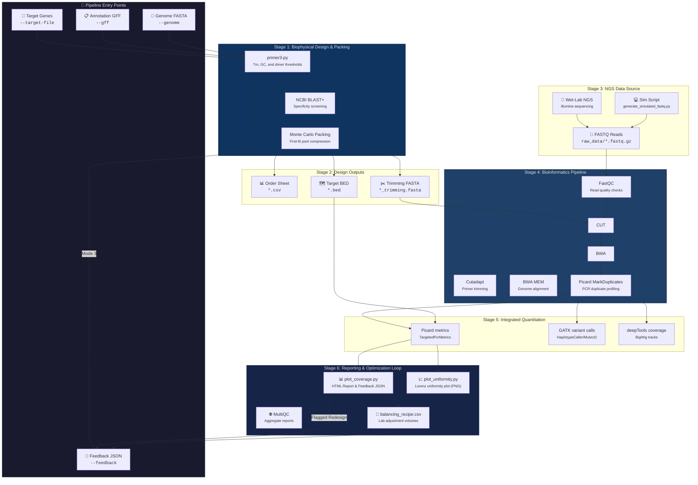
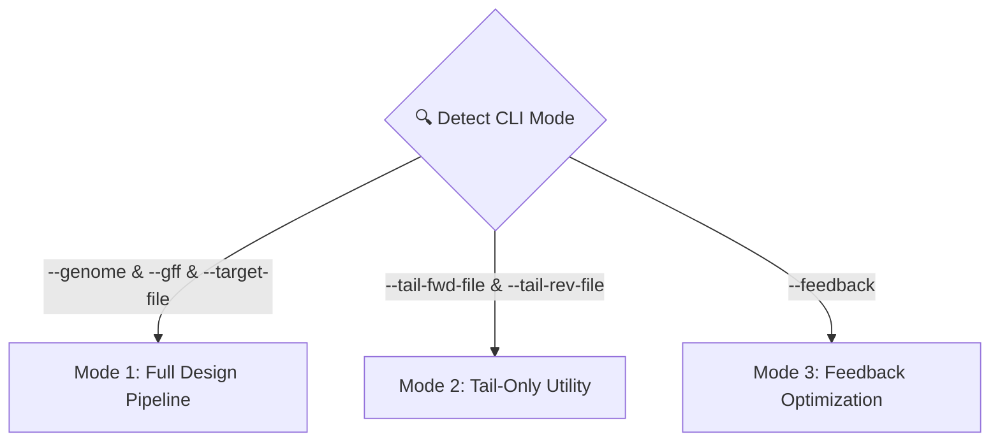

# 🧬 Multiplex PCR Ecosystem: Professional User Manual (v10.0)

Welcome to the **Integrated Multiplex PCR Ecosystem**. This codebase provides a complete, production-grade, software-defined bioinformatics toolkit for designing targeted sequencing primer panels, simulating PCR performances, executing Next-Generation Sequencing (NGS) data analysis, and closing the wet-dry loop with automated physical primer pool re-balancing.

---

## 🔄 Pipeline Flow & System Architecture

The following diagram illustrates how the system's design and analysis stages integrate. The workflow initiates with target genomic files, executes biophysical screening, runs wet-lab sequencing or in-silico simulation, feeds data into an automated Nextflow alignment pipeline, and calculates volume adjustments to optimize subsequent PCR runs.



---

## 📂 Repository Layout

This project isolates biophysical design, NGS analysis, simulation, and curation scripts to maintain a modular architecture.

| Path | Type | Purpose / Description |
| :--- | :--- | :--- |
| [`design.py`](file:///c:/Users/hughe/260523/my_amplicon_project/design.py) | Python Script | Primers panel generator, adapter tailing tool, and feedback loop processor. |
| [`core/`](file:///c:/Users/hughe/260523/my_amplicon_project/core) | Directory | Biophysical calculations and I/O utility scripts. |
| ├─ [`core/biophysics.py`](file:///c:/Users/hughe/260523/my_amplicon_project/core/biophysics.py) | Python Script | Tm formulas, primer3-py wrappers, dimer thresholds, and 5' hairpin clamping. |
| ├─ [`core/adapters.py`](file:///c:/Users/hughe/260523/my_amplicon_project/core/adapters.py) | Python Script | Standardized NGS adapters (P5/P7) and tailed-oligo formatting logic. |
| └─ [`core/io_utils.py`](file:///c:/Users/hughe/260523/my_amplicon_project/core/io_utils.py) | Python Script | Parsers for BED targets, lists, and synthesis recipe exports. |
| [`analysis/`](file:///c:/Users/hughe/260523/my_amplicon_project/analysis) | Directory | Nextflow pipeline, plotting utilities, and simulator. |
| ├─ [`analysis/main.nf`](file:///c:/Users/hughe/260523/my_amplicon_project/analysis/main.nf) | Nextflow Script | DSL2 pipeline orchestrating QC, alignment, duplicate tagging, metrics, and variant calling. |
| ├─ [`analysis/nextflow.config`](file:///c:/Users/hughe/260523/my_amplicon_project/analysis/nextflow.config) | Nextflow Config | Resource bounds and profile definitions. |
| ├─ [`analysis/generate_simulated_fastq.py`](file:///c:/Users/hughe/260523/my_amplicon_project/analysis/generate_simulated_fastq.py) | Python Script | Generates synthetic read pairs with mutations, non-uniformity, and thermal gradients. |
| ├─ [`analysis/plot_coverage.py`](file:///c:/Users/hughe/260523/my_amplicon_project/analysis/plot_coverage.py) | Python Script | Parses Picard metrics to output coverage dashboards and balancing recommendations. |
| ├─ [`analysis/plot_uniformity.py`](file:///c:/Users/hughe/260523/my_amplicon_project/analysis/plot_uniformity.py) | Python Script | Generates Paragon-style log-scale scatter plots showing panel uniformity. |
| └─ [`analysis/analysis_utils.py`](file:///c:/Users/hughe/260523/my_amplicon_project/analysis/analysis_utils.py) | Python Script | Shared parser library for Picard PCR metrics files. |
| [`scripts/`](file:///c:/Users/hughe/260523/my_amplicon_project/scripts) | Directory | Helper utilities for design input preparation and diagnostic analysis. |
| ├─ [`scripts/curate_sparse_targets.py`](file:///c:/Users/hughe/260523/my_amplicon_project/scripts/curate_sparse_targets.py) | Python Script | Identifies physically separated, non-overlapping target genes from a GFF model. |
| └─ [`scripts/measure_kmer_uniqueness.py`](file:///c:/Users/hughe/260523/my_amplicon_project/scripts/measure_kmer_uniqueness.py) | Python Script | Measures genome-wide k-mer frequencies to assess off-target cross-priming risks. |
| [`common_refs/`](file:///c:/Users/hughe/260523/my_amplicon_project/common_refs) | Directory | Genomes (FASTA format) and annotation models (GFF format). |
| [`design/`](file:///c:/Users/hughe/260523/my_amplicon_project/design) | Directory | Input target lists and output directories containing generated panels. |
| [`ncbi_data/`](file:///c:/Users/hughe/260523/my_amplicon_project/ncbi_data) | Directory | Working directory for local genome BLAST databases. |
| [`raw_data/`](file:///c:/Users/hughe/260523/my_amplicon_project/raw_data) | Directory | Destination folder for raw FASTQ inputs. |
| [`results/`](file:///c:/Users/hughe/260523/my_amplicon_project/results) | Directory | Structured outputs of Nextflow pipeline runs (BAMs, VCFs, HTML reports). |
| [`test_design.py`](file:///c:/Users/hughe/260523/my_amplicon_project/test_design.py) | Python Test Suite | Pytest unit test coverage verifying parser and thermodynamic utility functions. |
| [`Dockerfile`](file:///c:/Users/hughe/260523/my_amplicon_project/Dockerfile) | Docker Configuration | Multi-stage container recipe building the conda environment and pipeline tools. |
| [`environment.yml`](file:///c:/Users/hughe/260523/my_amplicon_project/environment.yml) | Conda Environment | Declared bioconda, conda-forge packages, and Python packages. |

---

## 🛠️ Installation & Environment Setup

This project is built container-first to isolate the complex bioinformatics stack (BWA, GATK4, Picard, Nextflow, Primer3, BLAST+, Cutadapt, deeptools) from host systems, ensuring reproducibility.

### 🐳 Method A: Docker-First Containerization (Recommended)

1. **Build the Container**:
   ```bash
   docker build -t amplicon-project .
   ```
2. **Execute Commands via Docker**:
   * **Design**: 
     ```bash
     docker run -v $(pwd):/app amplicon-project python design.py [args]
     ```
   * **Analyze**: 
     ```bash
     docker run -v $(pwd):/app amplicon-project nextflow run analysis/main.nf [args]
     ```

### 🐍 Method B: Native Conda Environment (Linux/WSL)

For local development or when running outside Docker, build the environment using micromamba or conda:

1. **Create the environment**:
   ```bash
   conda env create -f environment.yml
   ```
   *Or using micromamba (much faster):*
   ```bash
   micromamba create -y -n amplicon_pipeline -f environment.yml
   ```
2. **Activate the environment**:
   ```bash
   conda activate amplicon_pipeline
   ```
3. **Verify the environment**:
   Verify that all CLI utilities are exposed in your path:
   ```bash
   nextflow -version
   bwa
   samtools --version
   gatk --version
   pytest test_design.py -v
   ```

---

## 🎯 Module 1: Primer Design (`design.py`)

The unified design tool is powered by the [`core/biophysics.py`](file:///c:/Users/hughe/260523/my_amplicon_project/core/biophysics.py) library. It parses coordinates, runs BLAST checks to prevent off-target sequencing, applies thermodynamic filters to avoid primer dimerization, and optimizes multiplexing configurations.

### 🧪 Biophysical Calibration & Rules
The panel design engine implements thermodynamic constraints, calibrated for high-performance DNA polymerases like **Roche KAPA HiFi HotStart ReadyMix**.

* **Strict Salt Calibration**: Buffers are modeled at $2.5\,\text{mM}\ \text{Mg}^{++}$ and $1.2\,\text{mM}$ total dNTPs ($0.3\,\text{mM}$ each). Calculations use the SantaLucia 1998 salt correction formula.
* **Ideal Primer Properties**:
  * **Melting Temp ($T_m$)**: $59.0^\circ\text{C}$ to $61.0^\circ\text{C}$ (Optimum: $60.0^\circ\text{C}$).
  * **GC Content**: $40\%$ to $60\%$.
  * **Primer Size**: $19$ to $21$ base pairs.
  * **Product Amplicon Size**: $150$ to $250$ base pairs (with automatic fallback strategies spanning $100$ to $350$ base pairs).
* **Dimerization Constraints**:
  * **Self-Dimerization**: Max allowed $\Delta G = -9.0\,\text{kcal/mol}$.
  * **Cross-Heterodimerization**: Max allowed $\Delta G = -8.0\,\text{kcal/mol}$ across all primers in the pool.
  * **3' End Stability (Extender Dimer Check)**: Strict safety floor of $-6.0\,\text{kcal/mol}$ to prevent primer extension from forming primer dimers.
* **Oligo Modification (Hairpin Clamps)**:
  * By default, primers use the `rc_tailed` format (reverse-complement sequence plus full adapter tail).
  * In `fwd_tailed` mode, they are generated as forward-sequence plus a truncated tail. You can add a 5' hairpin clamp (`--add-hairpin-clamp`) that folds back at high temperatures ($\Delta G \approx -11.9\,\text{kcal/mol}$ stem stability) to suppress dimer formation.

---

### 🗺️ Operational Modes

The `design.py` script routes execution dynamically based on the arguments supplied.



#### Mode 1: Full Design Pipeline
Generates multiplex panels from scratch using a GFF model, genomic FASTA file, and target gene list:
```bash
python design.py \
    --genome common_refs/ecoli_genome.cleaned.fna \
    --gff common_refs/genomic.gff \
    --target-file design/targets/housekeeping_genes.txt \
    --blast-db ncbi_data/ecoli_db \
    --num-candidates 50 \
    --monte-carlo-iters 200 \
    --output-prefix design/output/housekeeping_panel
```

* **Genomic Overlap / Interleaved Pools**: If targets overlap, the script automatically partitions them into separate, non-overlapping primer pools (e.g., Pool 1 & Pool 2) to prevent on-target cross-priming.
* **Monte Carlo Packing**: Randomizes target ordering and applies a First-Fit packing engine (`--monte-carlo-iters`) to find the global minimum number of pools.

#### Mode 2: Tail-Only Utility
Appends standardized P5/P7 adapter sequences to pre-existing forward and reverse primer files:
```bash
python design.py \
    --tail-fwd-file design/targets/fwd_primers.txt \
    --tail-rev-file design/targets/rev_primers.txt \
    --oligo-format fwd_tailed \
    --output-prefix design/output/tailed_oligos
```

#### Mode 3: Feedback Optimization
Adjusts pools dynamically using quality control stats and redesigns failed primers:
```bash
python design.py \
    --genome common_refs/ecoli_genome.cleaned.fna \
    --gff common_refs/genomic.gff \
    --feedback results/coverage/Anneal_63C_balancing_feedback.json \
    --rescue \
    --output-prefix design/output/rebalanced_panel
```

---

### ⚙️ Command-Line Arguments: `design.py`

| Parameter | Mode | Type | Default Value | Description |
| :--- | :--- | :--- | :--- | :--- |
| `--genome` | Design / Feedback | Path | `common_refs/ecoli_genome.fna` | Reference genome FASTA. Cleans headers automatically. |
| `--gff` | Design / Feedback | Path | `common_refs/genomic.gff` | Genome annotation model for coordinate mapping. |
| `--target-file` | Design | Path | *None* | Plain-text file list of target gene IDs (one per line). |
| `--blast-db` | Design | String | `ncbi_data/ecoli_db` | Output prefix for the generated local BLAST database. |
| `--force-single-pool` | Design | Flag | `False` | Forces design into a single pool even if overlaps exist. |
| `--force-sparse` | Design | Flag | `False` | Enforces zero overlaps between amplicons in a single pool. |
| `--monte-carlo-iters`| Design | Integer| `20` | Shuffles target orders to compress panel pools. |
| `--force-multiprime` | Design | Flag | `False` | Allows multi-locus primer hits (e.g., 16S rRNA genes). |
| `--num-candidates` | Design | Integer| `25` | Number of candidate pairs designed per target before packing. |
| `--max-heterodimer-dg`| Design | Float | `-8.0` | Threshold $\Delta G$ (kcal/mol) for pool-wide heterodimers. |
| `--max-self-dimer-dg` | Design | Float | `-9.0` | Threshold $\Delta G$ (kcal/mol) for self-binding dimers. |
| `--max-end-stability-dg`| Design | Float | `-6.0` | Maximum 3' end stability $\Delta G$ to prevent extensions. |
| `--oligo-format` | All | Enum | `rc_tailed` | Format of tails: `rc_tailed` or `fwd_tailed`. |
| `--add-hairpin-clamp`| Design | Flag | `False` | Appends a 5' hairpin stem clamp (requires `fwd_tailed`). |
| `--feedback` | Feedback | Path | *None* | Path to the balancing feedback JSON from the analysis run. |
| `--rescue` | Feedback | Flag | `False` | Shifts target windows if design fails or has no coverage. |
| `--tail-fwd-file` | Tail-Only | Path | *None* | List of forward primer sequences to append tails to. |
| `--tail-rev-file` | Tail-Only | Path | *None* | List of reverse primer sequences to append tails to. |
| `--output-prefix` | All | Path | `output/final_primers` | Output prefix for CSV, BED, FASTA, and DIMERS files. |

---

## 💻 Module 2: Sequencing Simulation (`generate_simulated_fastq.py`)

To validate panels in silico, the ecosystem includes a sequencing simulator that models read outputs, target mutations, and thermal gradient behaviors.

```bash
python analysis/generate_simulated_fastq.py \
    --genome common_refs/ecoli_genome.cleaned.fna \
    --bed design/output/final_primers_pool_1.bed \
    --output-dir raw_data \
    --sample-name Anneal_63C \
    --coverage 500 \
    --thermal-bias 63.0 \
    --non-uniform
```

### 📈 Simulation Features
* **Mutation Injection**: Automatically introduces random Single Nucleotide Variants (SNVs) at a rate of $1\%$ to simulate genetic diversity.
* **Thermal Annealing Modeling**: Simulates coverage drop-offs based on temperature differences between the simulated run temperature (`--thermal-bias`) and the optimal primer melting temperature (centered near $62^\circ\text{C}$):
  $$\text{Coverage Scaling} = \max\left(0.05, 1.0 - 0.2 \times |T_{\text{anneal}} - T_{\text{opt}}|\right)$$
* **Non-Uniformity**: Randomly scales target coverages between $10\%$ and $200\%$ of target coverage when `--non-uniform` is supplied.

---

## ⚙️ Module 3: Nextflow Analysis Pipeline (`main.nf`)

The bioinformatics pipeline processes raw sequences to generate alignments, deduplicate reads, calculate coverage, call variants, and output reports.

```bash
# Run analysis using WSL/Linux
nextflow run analysis/main.nf \
    --reads "raw_data/Anneal_63C_R{1,2}.fastq.gz" \
    --genome "common_refs/ecoli_genome.cleaned.fna" \
    --bed "design/output/final_primers_pool_1.bed" \
    --primers "design/output/final_primers_pool_1_trimming.fasta" \
    --mode germline \
    --outdir results
```

### 🔄 Pipeline Execution Steps

```mermaid
flowchart LR
    FQC["1. Quality Control<br/>(FastQC)"]
    CUT["2. Adapter Trimming<br/>(Cutadapt)"]
    BWA["3. Alignment<br/>(BWA MEM)"]
    SRT["4. Sort & Index<br/>(Samtools)"]
    DUP["5. Duplicate Tagging<br/>(MarkDuplicates)"]
    PIC["6. Target Metrics<br/>(TargetedPcrMetrics)"]
    VAR["7. Variant Calling<br/>(GATK Haplotype/Mutect2)"]
    REP["8. Visualization<br/>(plot_coverage & MultiQC)"]

    FQC --> CUT --> BWA --> SRT --> DUP --> PIC --> VAR --> REP
```



1. **FASTQC**: Profiles raw reads to output base quality distributions.
2. **TRIM_PRIMERS**: Runs Cutadapt to trim adapter/primer sequences. Un-trimmed reads are discarded to ensure specific mapping.
3. **BUILD_INDICES / ALIGN**: Indexes genomes and aligns reads using BWA MEM.
4. **SORT_INDEX_BAM**: Sorts and index BAM alignments using Samtools.
5. **MARK_DUPLICATES**: Profiles PCR duplicate rates using Picard.
6. **PICARD_METRICS**: Runs Picard `CollectTargetedPcrMetrics` to calculate on-target percentages and uniformity metrics.
7. **VARIANT_CALLING**:
   * **Germline Mode (Default)**: Uses GATK `HaplotypeCaller` with a conservative PCR indel model to detect mutations.
   * **Somatic Mode**: Uses GATK `Mutect2` in tumor-only configuration to identify low-frequency mutations.
8. **COVERAGE_TRACKS**: Generates BigWig browser coverage files using deepTools `bamCoverage`.
9. **PLOT_COVERAGE & PLOT_UNIFORMITY**: Compiles custom HTML reports and coverage plots.
10. **MULTIQC**: Aggregates pipeline outputs into a unified web report.

---

## 🔄 Module 4: Feedback Loop & Pool Re-balancing

Uniform amplification is critical in multiplex PCR. The feedback loop automatically balances pool chemistry by adjusting volumes based on coverage.

### 📐 Balancing Calculations
For each target $t$, the script evaluates coverage to calculate adjustment recommendations:

1. **Relative Mean Coverage ($R_t$)**:
   $$R_t = \frac{C_t}{C_{\text{overall}}}$$
   Where $C_t$ is target mean coverage, and $C_{\text{overall}}$ is overall mean coverage.
2. **Adjustment Factor ($A_t$)**:
   $$A_t = \frac{1}{R_t}$$
   *Capped in the range: $0.1 \le A_t \le 10.0$*
3. **Recommended Volume ($V_t$)**:
   $$V_t = V_{\text{baseline}} \times A_t$$
   *Where $V_{\text{baseline}} = 10.0\,\mu\text{L}$*

### 🛠️ Lab Action Matrix

| Rel. Mean ($R_t$) | Action | Badge Color | Physical Adjustment |
| :--- | :--- | :--- | :--- |
| **$R_t = 0.0$** | `🔥 FLAG FOR REDESIGN` | Magenta | Sequence failed. Shift window or relax thermodynamic bounds. |
| **$R_t < 0.2$** | `INCREASE concentration` | Red | Low coverage. Increase primer concentration up to 10.0x. |
| **$0.2 \le R_t < 0.5$** | `INCREASE concentration` | Orange | Mild low-bias. Increase primer concentration. |
| **$0.5 \le R_t \le 2.0$** | `Maintain current concentration`| Blue | Optimal performance. Keep concentration baseline. |
| **$R_t > 2.0$** | `DECREASE concentration` | Red/Yellow | Strong amplification bias. Dilute primer concentration down to 0.1x. |

### 🔄 Executing a Feedback Loop
1. The analysis pipeline outputs a feedback file: `results/coverage/SampleName_balancing_feedback.json`.
2. Feed this file back into the design script:
   ```bash
   python design.py \
       --genome common_refs/ecoli_genome.cleaned.fna \
       --gff common_refs/genomic.gff \
       --feedback results/coverage/Anneal_63C_balancing_feedback.json \
       --rescue \
       --output-prefix design/output/rebalanced_panel
   ```
3. This creates a pipetting volume table [`design/output/rebalanced_panel_rebalancing_recipe.csv`](file:///c:/Users/hughe/260523/my_amplicon_project/design/output/rebalanced_panel_rebalancing_recipe.csv) and automatically triggers window-shifted redesigns for failed targets:

   * **Synthesis Order Recipe Table Structure**:
     ```csv
     Target,Current_Rel_Mean,Adjustment_Factor,Action,Recommended_Vol_uL
     thrA,0.40x,2.50x,INCREASE concentration to 2.5x,25.00
     thrL,1.20x,0.83x,Maintain current concentration,8.33
     yqgC,0.00x,10.00x,🔥 FLAG FOR REDESIGN,100.00
     ```

---

## 📈 Quality Control & Visualization Outputs

### 1. The HTML Performance Dashboard
Saved in `results/coverage/SampleName_coverage_report.html`, this report contains:
* **Metric Cards**: Total amplicons, Mean Coverage, On-target percentage, Fold-80 Penalty, and Uniformity percentage.
* **Adjustments Table**: Interactive recommendations sorted by performance.
* **Interactive Coverage Bars**: Visual comparison of amplicon yields.

### 2. Paragon-Style Uniformity Plot
Saved in `results/coverage/SampleName_uniformity.png`, this plot visualizes coverage log-scales:
* **Y-Axis**: Relative Coverage (log-scale).
* **Reference Lines**: Mean (100% / 1.0x), 500% (5.0x threshold), and 20% (0.2x threshold).
* **Color Coding**: Blue dots for passing amplicons, and red dots for failing targets.

---

## 🚀 End-to-End Walkthrough Tutorial

Here is a step-by-step example workflow targeting 100 housekeeping genes.

### 📋 Step 1: Curate Targets
Filter the GFF file to identify 100 physically separated gene models (with a minimum distance of $2500\,\text{bp}$):
```bash
python scripts/curate_sparse_targets.py \
    common_refs/genomic.gff \
    design/targets/stress_test_100.txt \
    100 \
    2500
```

### 🎨 Step 2: Run Initial Design
Design compatible primer pools:
```bash
python design.py \
    --genome common_refs/ecoli_genome.fna \
    --gff common_refs/genomic.gff \
    --target-file design/targets/stress_test_100.txt \
    --blast-db ncbi_data/ecoli_db \
    --num-candidates 30 \
    --monte-carlo-iters 50 \
    --output-prefix design/output/V10_Ultrapool
```

### 💻 Step 3: Simulate NGS Reads
Model a sequencing run featuring non-uniformity and temperature gradients:
```bash
python analysis/generate_simulated_fastq.py \
    --genome common_refs/ecoli_genome.cleaned.fna \
    --bed design/output/V10_Ultrapool_pool_1.bed \
    --output-dir raw_data \
    --sample-name V10_Sample_Run \
    --coverage 400 \
    --thermal-bias 61.5 \
    --non-uniform
```

### ⚙️ Step 4: Run Alignment & Variant Pipeline
Process reads using Nextflow:
```bash
nextflow run analysis/main.nf \
    --reads "raw_data/V10_Sample_Run_R{1,2}.fastq.gz" \
    --genome "common_refs/ecoli_genome.cleaned.fna" \
    --bed "design/output/V10_Ultrapool_pool_1.bed" \
    --primers "design/output/V10_Ultrapool_pool_1_trimming.fasta" \
    --mode germline \
    --outdir results
```

### 🔄 Step 5: Execute Re-balancing
Process pipeline feedback to generate optimization recipes:
```bash
python design.py \
    --genome common_refs/ecoli_genome.cleaned.fna \
    --gff common_refs/genomic.gff \
    --feedback results/coverage/V10_Sample_Run_balancing_feedback.json \
    --rescue \
    --output-prefix design/output/V10_Optimized
```

---

## ❓ Frequently Asked Questions

**Q: Why does the script output multiple primer pool files?**  
A: Overlapping amplicons in a single pool will cause cross-priming and form primer dimers. The packing algorithm automatically splits overlapping targets into independent pools (e.g., `_pool_1.csv`, `_pool_2.csv`) to maintain assay specificity.

**Q: What is the Fold-80 Base Penalty?**  
A: It measures coverage uniformity. A Fold-80 penalty of 1.5 means you need 1.5 times more sequencing depth to bring 80% of targets up to the mean coverage. Lower values indicate higher panel uniformity.

**Q: How does the primer rescue feature function?**  
A: When `--rescue` is enabled, if a target gene cannot design compatible primers within its default window, the engine shifts the extraction region upstream or downstream (by 25bp, then 30% window jumps) to bypass complex sequences.

**Q: Can I process single-end (SE) FASTQ data?**  
A: Yes. The Nextflow pipeline automatically detects whether inputs are single-end or paired-end, and configures Cutadapt and BWA MEM parameters accordingly.
