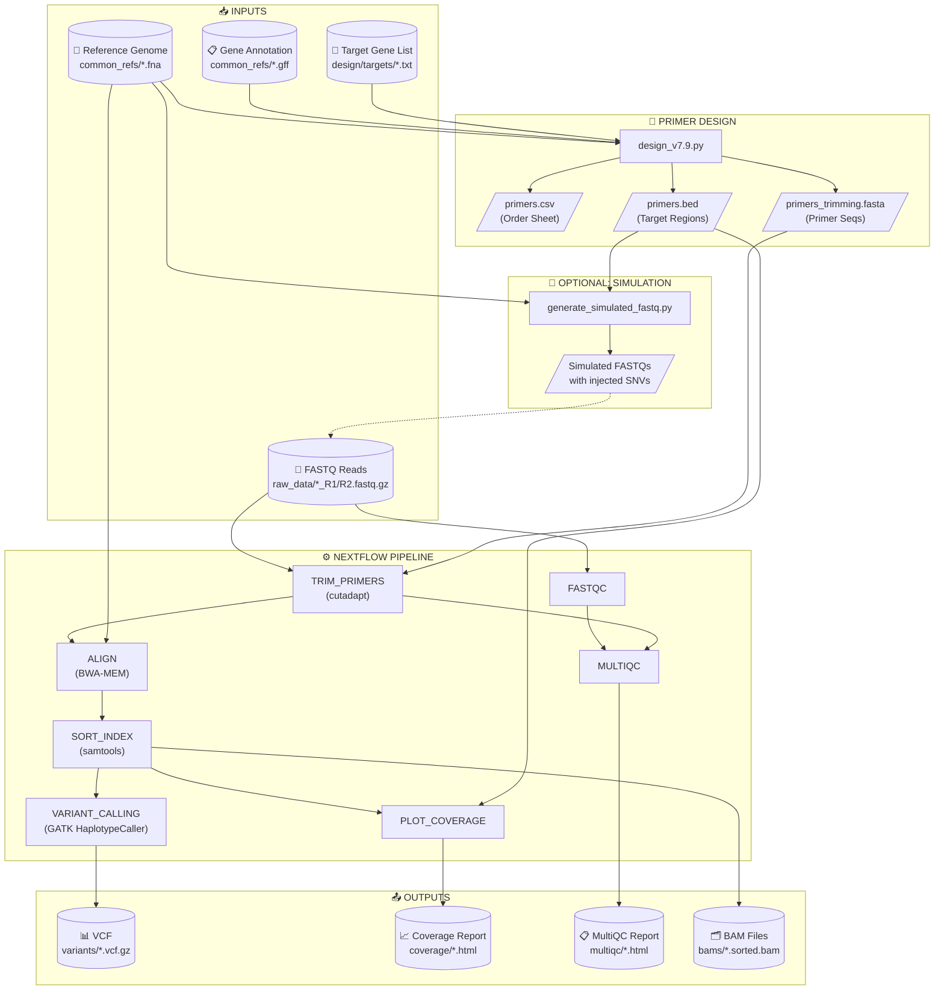

# My Amplicon Project

An integrated **Multiplex PCR Primer Designer** and **Amplicon Sequencing Analyzer** for targeted sequencing workflows.

---

## 📂 Project Structure

```
my_amplicon_project/
├── common_refs/           # Reference genomes & annotations
├── design/                # Primer design tool
│   ├── design_v7.9.py
│   ├── test_design.py     # Unit tests (pytest)
│   ├── targets/           # Gene lists
│   └── output/            # Generated primers
├── analysis/              # Nextflow pipeline
│   ├── main.nf
│   ├── setup_wsl.sh       # One-click environment setup
│   ├── run_analysis.sh    # Execution wrapper
│   ├── plot_coverage.py   # Coverage visualization
│   └── generate_simulated_fastq.py
├── raw_data/              # Input FASTQ files
├── results/               # Outputs (VCF, reports)
├── Dockerfile             # Container build
└── .github/workflows/     # CI/CD
```

---

## 🚀 Quick Start

### Option A: Using Docker (Recommended)

```bash
# Build
docker build -t amplicon-pipeline .

# Run (mount data directories)
docker run -v $(pwd)/raw_data:/app/raw_data \
           -v $(pwd)/results:/app/results \
           amplicon-pipeline
```

### Option B: WSL Setup (Windows)

```bash
# 1. Run setup script (installs Miniconda + all dependencies)
wsl bash analysis/setup_wsl.sh

# 2. Activate environment
source ~/miniconda3/etc/profile.d/conda.sh
conda activate amplicon_pipeline
```

---

## 🧬 Workflow

### Workflow Diagram



### Step 1: Design Primers

```bash
cd design
python design_v7.9.py \
    --target-file targets/housekeeping_genes.txt \
    --oligo-format fwd_tailed \
    --add-hairpin-clamp
```

**Outputs** (in `design/output/`):
- `final_primers_pool_1.csv` - Order sheet
- `final_primers_pool_1.bed` - Target regions
- `final_primers_pool_1_trimming.fasta` - For primer trimming

### Step 2: Prepare Data

**Option A: Real Data**  
Place paired-end FASTQs in `raw_data/` (e.g., `Sample_R1.fastq.gz`)

**Option B: Simulated Data**
```bash
wsl bash -c "source ~/miniconda3/etc/profile.d/conda.sh && \
  conda activate amplicon_pipeline && \
  python analysis/generate_simulated_fastq.py \
    --genome common_refs/ecoli_genome.cleaned.fna \
    --bed design/output/final_primers_pool_1.bed \
    --output-dir raw_data"
```

### Step 3: Run Analysis

```bash
wsl bash -c "source ~/miniconda3/etc/profile.d/conda.sh && \
  conda activate amplicon_pipeline && \
  cd analysis && bash run_analysis.sh"
```

---

## 📊 Outputs

| File | Description |
|------|-------------|
| `results/variants/*.vcf.gz` | Variant calls |
| `results/coverage/*_coverage_report.html` | Per-amplicon coverage |
| `results/multiqc/multiqc_report.html` | QC summary |
| `results/bams/*.sorted.bam` | Aligned reads (for IGV) |

---

## 🧪 Testing

### Unit Tests
```bash
cd design
pip install pytest
pytest test_design.py -v
```

### CI/CD
GitHub Actions automatically runs tests on push to `main`. See `.github/workflows/test-pipeline.yml`.

---

## 🛠️ Troubleshooting

| Error | Cause | Fix |
|-------|-------|-----|
| "Bad input / Non-standard base" | CRLF line endings | `tr -d '\r' < file > fixed` |
| "Process requirement exceeds memory" | WSL RAM limit | Edit `nextflow.config`: `memory = '4 GB'` |
| Picard metrics failed | Interval list mismatch | Non-critical (ignored) |

---

## 📜 License

MIT
